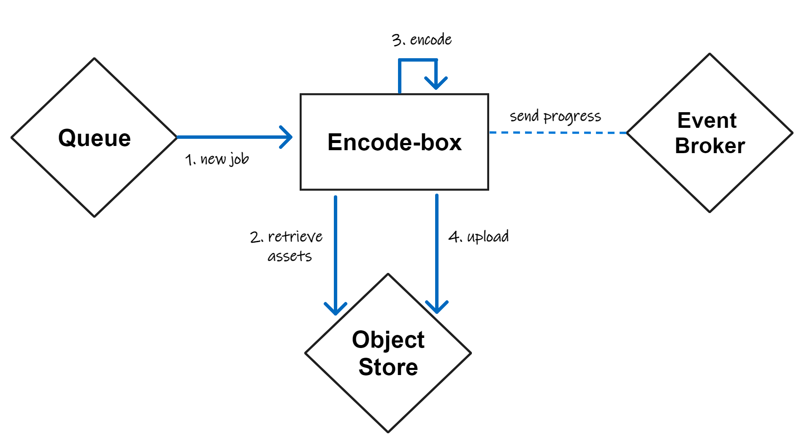

# Encode box

[](https://codecov.io/gh/SoTrxII/encode-box)
[](https://hub.docker.com/r/sotrx/encode-box/)


Encode-box is an asynchronous encoding server. Its goal takes videos/audios/images assets from a remote object storage ,
mix them into a single video, and upload the resulting video in the same object storage.

This solution is mainly used to mix recording made by Pandora with a video source.

## Usage 
The encode box is meant to be used as a long running process, pulling job from a work queue and deleting 
it only when the job is done.

The encoding itself is a 4 step process :
1. A new job is received as an HTTP request containing [an encoding job](#job-format)
2. A job will contains references to assets located in the remote object storage. These assets are downloaded on the local file system
3. Using FFMPEG, the encoding is performed. While encoding, [progress events](#progress-event) are emitted on the specified topic of the event broker (see [configuration](#configuration))
4. Once the encoding is finished, the resulting video is uploaded back onto the remote object storage. All downloaded/created file are deleted after this.



### Job format
Encode-box provides two endpoints :
 - POST/OPTIONS **/encode** : process jobs **sychronously**
 - GET **/healthz** : [health endpoint](https://microservices.io/patterns/observability/health-check-api.html). Currently very limited

#### Sending a new job

A valid job format for the **/encode** endpoint is the following: 

```jsonc
{
  // Record UUID
  "recordId": string,
  // Storage backend retrieval keys for all videos tracks
  "videoKey":string,
  // Storage backend retrieval keys for all audio tracks
  "audiosKeys":string[],
  // Storage backend retrieval keys for the image track
  "imageKey":string,
  // All available options for encoding
  "options":string,

}
```

Be aware that this endpoint is **entirely synchronous**, a 200 OK response will only be fired **after
the encoding itself finished**. 
Depending on your hardware, this can be a multiple hours operation.

This is made this way to only acknowledge  a message in the input message queue after we made sure the job has completed successfully.


### Progress event

While encoding, if any event broker is configured, the encode-box will periodically send progress events 
```jsonc
{
    // Record id of the currently processed record
    recordId: string,
    // Either 0 -> "In progress", 1 -> "Done", 2 -> "Error"
    encodeState: iota,
    // Depends on the encode state
    data: <> 
}

```

While **in progress**, the `data` attribute will contains the following attributes

```jsonc
{
    // Number of total frames processed
    frames: int64,
    // Number of frames processed each second
    fps: int,
    // FFMPEG "q" factor https://trac.ffmpeg.org/wiki/Encode/H.264 
    quality: float32,
    // Estimated size of the converted file (kb)
    size: int64,
	// Total processed time
    time: Duration,
    // Target bitrate
    bitrate: string,
    // Encoding speed. A "2" means 1 second of encoding would be a 2 seconds playback
    speed: float32
}
```

If the encode state is **Done**, data will be empty.
If the encode state is **Error**, data will contains the error string.


## Configuration

The following env variables can be sued to configure encode-box:
- **OBJECT_STORE_NAME** (required) : Name of the [object storage Dapr component](https://docs.dapr.io/reference/components-reference/supported-bindings/s3/) to use
- **PUBSUB_NAME** (optional) : Name of the [dapr pubsub component](https://docs.dapr.io/reference/components-reference/supported-pubsub) to use. If not defined, progress event won't be fired.
- **PUBSUB_TOPIC_PROGRESS** (optional) : Name of topic to send progress event into. Default to *encoding-state*.


### Dapr 

[Dapr](https://dapr.io/) is used to decouple the backing services from their implementations. As the resulting code is 
non specific, any compatible Pub/Sub solution or object storage solution can be used with this project.

Sample dapr components, used for local development, are located in the ``dapr/components`` directory.

### Binding with a message queue

To retrieve messages from a queue, a [declarative subscription](https://docs.dapr.io/developing-applications/building-blocks/pubsub/subscription-methods/) is used.

```yaml
# dapr/components/subscribe-to-queue.yml
apiVersion: dapr.io/v1alpha1
# Creates a new subscription...
kind: Subscription
metadata:
  # ... called encode-sub...
  name: encode-sub
spec:
  # ...which forwards messages published in the topic "encodings"...
  topic: encodings
  # ... of the queue "message-queue" ...
  pubsubname: message-queue
  # .. to the "/encode" endpoint...
  route: /encode
# Of the following services
scopes:
  - encode-box
```

## Deployment

Although meant to be deployed on Kubernetes, a sample deployment using docker-compose is located [here](./docs/deployment.md).


## Local development 

### Requirements

To run the project, the following are required :
```sh
GO      >= 1.18
FFMPEG  >= 4.3.2
```
